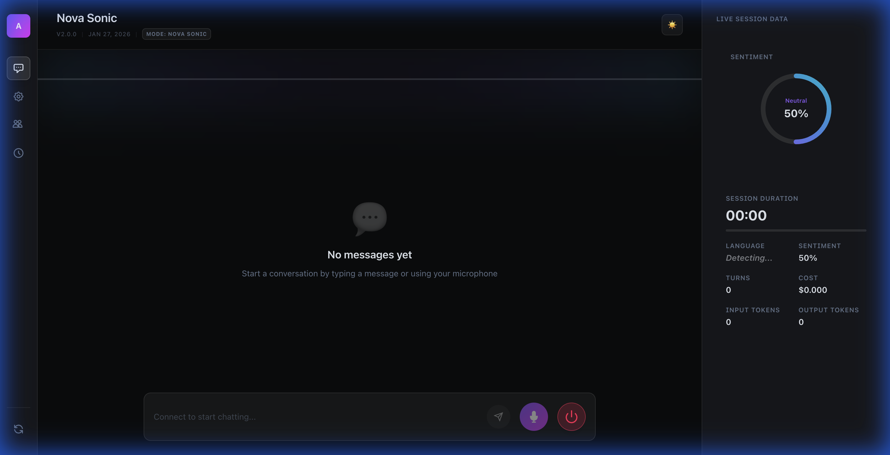
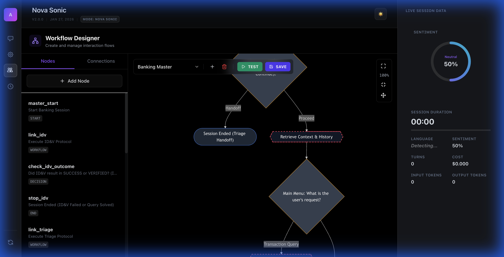
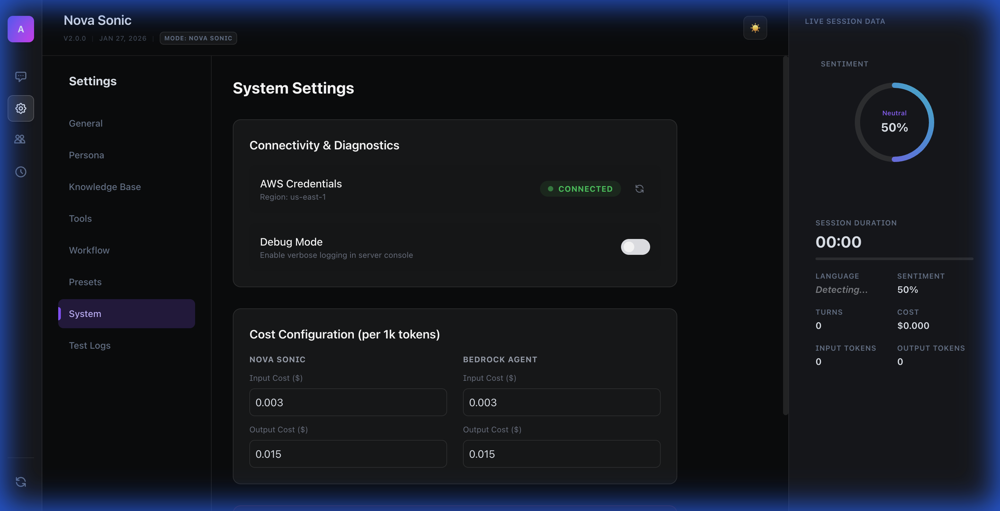
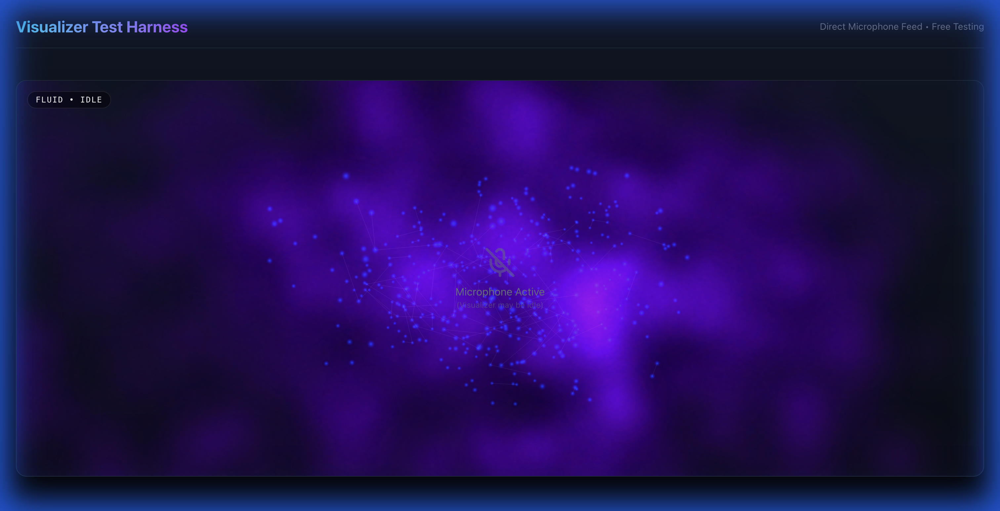

# Voice S2S - Real-Time Voice-to-Voice Assistant

A comprehensive, production-ready real-time speech-to-speech interaction platform powered by Amazon Nova 2 Sonic, featuring advanced tool execution, workflow automation, sentiment analysis, and enterprise-grade banking capabilities.

## 🎯 Overview

Voice S2S is a full-stack WebSocket-based voice assistant that enables natural, real-time conversations with AI. Built on Amazon Nova 2 Sonic's bidirectional streaming capabilities, it supports both direct AI interactions and complex agent-based workflows for enterprise applications like banking.

### Architecture

```
Browser (Microphone) → WebSocket → Backend Server → Amazon Nova 2 Sonic → Backend Server → WebSocket → Browser (Speakers)
                                          ↓
                                    Tool Execution
                                    Agent Workflows
                                    Knowledge Bases
```

### Voice-Agnostic Agent Architecture

Voice S2S now features a **Voice Side-Car Pattern** that decouples agent business logic from I/O mechanisms. This architecture enables developers to write agent logic once and deploy it in voice, text, or hybrid modes with minimal configuration.

```
┌─────────────────────────────────────────────────────────────┐
│                     Unified Runtime                          │
│  ┌────────────────────────────────────────────────────────┐ │
│  │  Mode Selection (ENV: MODE = voice | text | hybrid)   │ │
│  └────────────────────────────────────────────────────────┘ │
└─────────────────────────────────────────────────────────────┘
                            │
        ┌───────────────────┼───────────────────┐
        │                   │                   │
        ▼                   ▼                   ▼
┌──────────────┐    ┌──────────────┐    ┌──────────────┐
│ Voice        │    │ Text         │    │ Hybrid       │
│ Side-Car     │    │ Adapter      │    │ (Both)       │
└──────────────┘    └──────────────┘    └──────────────┘
        │                   │                   │
        └───────────────────┼───────────────────┘
                            │
                            ▼
                    ┌──────────────┐
                    │ Agent Core   │
                    │ (Business    │
                    │  Logic)      │
                    └──────────────┘
                            │
        ┌───────────────────┼───────────────────┐
        │                   │                   │
        ▼                   ▼                   ▼
┌──────────────┐    ┌──────────────┐    ┌──────────────┐
│ LangGraph    │    │ Tool         │    │ Gateway      │
│ Executor     │    │ Execution    │    │ Integration  │
└──────────────┘    └──────────────┘    └──────────────┘
```

**Key Components:**

- **Agent Core**: Voice-agnostic LangGraph business logic handling workflow execution, tool calling, and state management
- **Voice Side-Car**: Wraps Agent Core with voice I/O via SonicClient for bidirectional audio streaming
- **Text Adapter**: Wraps Agent Core with WebSocket text I/O for text-based interactions
- **Unified Runtime**: Single entry point supporting voice, text, or hybrid modes via `MODE` environment variable

**Benefits:**

- **Write Once, Deploy Anywhere**: Agent business logic is independent of I/O mechanism
- **Easy Extension**: Add new agents with ~10 lines of configuration (workflow JSON + environment variables)
- **Code Reduction**: Eliminated 1,183 lines of duplicated code by extracting common logic
- **Backward Compatible**: All existing agents migrate seamlessly to the new architecture

## 📸 Visuals

| Dashboard | Workflow Designer |
|-----------|------------------|
|  |  |

| System Settings | Visualizer Test Harness |
|-----------------|-------------------------|
|  |  |


## ✨ Core Features

### 🎙️ **Real-Time Voice Interaction**
- **Bidirectional Streaming**: True real-time speech-to-speech with <500ms latency
- **Multiple Voices**: Choose from Nova's expressive voice library (Matthew, Tiffany, Amy, etc.)
- **Audio Visualization**: Multiple premium visualization modes (AntiGravity, Fluid, ParticleVortex, PulseWaveform) powered by Three.js and Canvas
- **PCM16 Audio**: High-quality 16kHz mono audio streaming
- **Interruption Handling**: Natural conversation flow with mid-sentence interruptions
- **Sentiment Halo**: Visual feedback around the assistant based on real-time sentiment analysis

### 🧠 **Dual Architecture Modes**

#### 1. **Nova Sonic Direct Mode** (Recommended)
- Fast, natural tool execution
- Native tool calling with visual feedback
- Ideal for: Time queries, general chat, quick information retrieval
- Response time: 200-500ms

#### 2. **Bedrock Agent Mode** (Banking Bot)
- Complex multi-step workflows
- Full agent reasoning and planning
- Ideal for: Banking operations, mortgage calculations, dispute management
- Response time: 1-3s (includes reasoning)

### 💬 **Flexible Interaction Modes**
- **Chat + Voice**: Full functionality with both text and voice
- **Voice Only**: Hands-free operation, text input hidden
- **Chat Only**: Silent mode with audio muted

### 🛠️ **Native Tool System** (14 Built-in Tools)

#### Banking Tools
- `agentcore_balance`: Check account balance with sort code and account number
- `agentcore_transactions`: Retrieve recent transaction history
- `create_dispute_case`: File transaction disputes with merchant details
- `update_dispute_case`: Update existing dispute cases
- `lookup_merchant_alias`: Resolve merchant names from transaction codes

#### Mortgage Tools
- `calculate_max_loan`: Calculate maximum loan amount based on income
- `get_mortgage_rates`: Retrieve current mortgage rates
- `value_property`: Get property valuations
- `check_credit_score`: Check credit scores for mortgage applications

#### Identity & Verification
- `perform_idv_check`: Identity verification with sort code and account number validation

#### Knowledge & Information
- `search_knowledge_base`: RAG-powered knowledge base queries
- `uk_branch_lookup`: Find nearest bank branches by postcode

#### System Tools
- `get_server_time`: Current server time with timezone support
- `manage_recent_interactions`: Conversation history management

### 💭 **LLM-Driven Sentiment Analysis**
- **Real-time Sentiment Tracking**: Live graph showing conversation sentiment over time
- **Emoji Markers**: Visual sentiment indicators (😊 😠) on messages
- **Score Range**: -1 (very negative) to 1 (very positive)
- **Robust Parsing**: Handles malformed sentiment tags gracefully
- **Live Dashboard**: Sentiment score displayed in sidebar and header

### 🕸️ **Visual Workflow System**
- **Drag-and-Drop Editor**: Build complex agent behaviors visually with a node-based interface
- **Interactive Workflow Journey**: Real-time tracking of user progress through defined workflows
- **Clickable Steps**: Jump directly to specific workflow steps in the chat transcript
- **Decision Trees**: Create branching logic based on user input and tool results
- **Dynamic Injection**: Workflows automatically injected into system prompts based on current state
- **Persona Coupling**: Link workflows to specific personas for tailored experiences
- **JSON Export**: Save and share workflow definitions easily

### 📚 **Knowledge Base Integration**
- **RAG Support**: Retrieve-Augment-Generate with external knowledge
- **Multiple KBs**: Support for multiple knowledge bases per session
- **Dynamic Configuration**: Add/remove knowledge bases via UI
- **Model Selection**: Choose embedding models per knowledge base

### 👤 **Persona & Prompt Management**
- **Preset Personas**: Coding Assistant, Pirate, French Tutor, Banking Bot, etc.
- **Custom Prompts**: Create and save custom system prompts
- **Langfuse Integration**: Prompt versioning and management
- **Speech Prompts**: Optional speech-specific instructions
- **Guardrails**: Core safety and quality rules

### 💾 **Smart Caching System**
- **Tool Result Caching**: Intelligent caching with tool-specific TTL
  - Time queries: 30 seconds
  - Account balance: 60 seconds
  - Weather data: 5 minutes
- **Fuzzy Query Matching**: Handles interrupted/repeated questions
- **Cost Optimization**: Prevents redundant API calls
- **Cache Invalidation**: Automatic expiration based on TTL

### 📊 **Session Analytics**
- **Real-time Stats**: Duration, token usage, cost tracking
- **Token Counting**: Separate input/output token metrics
- **Cost Calculation**: Configurable pricing per 1K tokens
- **Session History**: Complete conversation logs with sentiment data
- **User Feedback**: Thumbs Up/Down rating system with persistent storage
- **Langfuse Observability**: Full tracing and monitoring

### 🔔 **Toast Notification System**
- **Tool Processing Feedback**: Visual notifications for tool execution
- **Deduplication**: Prevents multiple notifications for same event
- **Auto-dismiss**: Configurable timeout with manual dismiss option
- **Status Indicators**: Success, error, and info states

### 🎨 **Modern UI/UX**
- **Dark Mode**: Sleek, professional dark theme
- **Responsive Design**: Works on desktop, tablet, and mobile
- **Sidebar Navigation**: Organized sections for settings, tools, workflows
- **Live Status Indicators**: Connection, recording, and processing states
- **Keyboard Shortcuts**: Efficient navigation and control
- **Accessibility**: ARIA labels and semantic HTML

## 🏗️ Technical Architecture

### Frontend (`/frontend-v2`)
- **Next.js & React**: Modern component-based architecture
- **TypeScript**: Type-safe frontend implementation
- **WebSocket Client**: Binary audio streaming with custom hooks
- **Tailwind CSS**: Modern utility-first styling
- **Shadcn UI**: Accessible component library
- **Recharts**: Advanced sentiment visualization

### Backend (`/backend`)
- **TypeScript**: Type-safe server implementation
- **WebSocket Server**: Binary frame handling
- **AWS SDK Integration**: Bedrock Runtime, Agent Runtime, Polly, Transcribe
- **Langfuse**: Observability and prompt management
- **Tool Execution Engine**: Dynamic tool loading and caching

### Agents (`/agents`) - Voice-Agnostic Architecture

The agent system uses a **Voice Side-Car Pattern** that separates business logic from I/O mechanisms:

#### Agent Core (`agent-core.ts`)
- **Voice-agnostic business logic**: Workflow execution, tool calling, state management
- **Session management**: Initialize, track, and clean up sessions
- **Tool execution**: Validate, route, and execute tools via ToolsClient
- **Handoff management**: Detect handoffs and preserve context across agent transfers
- **Session memory**: Store and restore verified user data, user intent
- **Observability**: Langfuse integration for tracing and analytics

#### Voice Side-Car (`voice-sidecar.ts`)
- **Wraps Agent Core** with voice I/O using SonicClient
- **Audio streaming**: Handle audio chunks, transcription, text-to-speech
- **Event translation**: Convert SonicClient events to Agent Core method calls
- **Lifecycle management**: Start, stop, error handling for voice sessions
- **Backward compatible**: Supports all existing voice features (interruption, sentiment, workflow updates)

#### Text Adapter (`text-adapter.ts`)
- **Wraps Agent Core** with WebSocket text I/O
- **Message forwarding**: Route text messages to Agent Core
- **Response handling**: Send Agent Core responses via WebSocket
- **Session lifecycle**: Initialize and clean up text sessions
- **Backward compatible**: Maintains existing text agent functionality

#### Unified Runtime (`agent-runtime-unified.ts`)
- **Single entry point** supporting voice, text, or hybrid modes
- **Mode selection**: Via `MODE` environment variable (`voice`, `text`, `hybrid`)
- **Dynamic initialization**: Load appropriate adapters based on mode
- **Gateway integration**: Register with Gateway, send heartbeats
- **Configuration loading**: Load workflow definitions and persona configurations

**Architecture Benefits:**
- **Separation of concerns**: Business logic independent of I/O
- **Code reuse**: Write once, deploy in any mode
- **Easy extension**: Add new agents with minimal configuration
- **Maintainability**: Reduced code duplication (~1,183 lines eliminated)

### Tools (`/tools`)
- **JSON Definitions**: Declarative tool specifications
- **Category System**: Banking, Mortgage, System, Custom
- **Dynamic Loading**: Hot-reload tool definitions
- **Metadata**: Descriptions, parameters, categories

### Workflows (`/workflows`)
- **Visual Editor**: Integrated flow builder
- **JSON Storage**: Workflow definitions per persona
- **Dynamic Injection**: Automatic prompt enhancement
- **Branching Logic**: Conditional flows based on user input

## 📦 Installation & Setup

### Prerequisites
- Node.js 18+ and npm
- AWS Account with Bedrock access
- Amazon Nova 2 Sonic model access in your region

### 1. Clone Repository
```bash
git clone <repository-url>
cd Voice_S2S
```

### 2. Install & Build Frontend
```bash
cd frontend-v2
npm install
npm run build
cd ..
```

### 3. Install Backend Dependencies
```bash
cd backend
npm install
```

### 3. Configure AWS Credentials

Create `.env` file in `backend/` directory:

```env
NOVA_AWS_REGION=us-east-1
NOVA_AWS_ACCESS_KEY_ID=your_access_key_here
NOVA_AWS_SECRET_ACCESS_KEY=your_secret_key_here
NOVA_AWS_SESSION_TOKEN=your_session_token_here  # Optional, for SSO/MFA
NOVA_SONIC_MODEL_ID=amazon.nova-2-sonic-v1:0
AGENT_CORE_RUNTIME_ARN=arn:aws:bedrock-agentcore:us-east-1:123456789012:runtime/YourRuntimeName

# Optional: Langfuse Integration
LANGFUSE_PUBLIC_KEY=your_public_key
LANGFUSE_SECRET_KEY=your_secret_key
LANGFUSE_HOST=https://cloud.langfuse.com
```

**Required IAM Permissions:**
```json
{
  "Version": "2012-10-17",
  "Statement": [
    {
      "Effect": "Allow",
      "Action": [
        "bedrock:InvokeModelWithBidirectionalStream",
        "bedrock-agentcore:InvokeAgentRuntime",
        "polly:SynthesizeSpeech",
        "transcribe:StartStreamTranscription"
      ],
      "Resource": "*"
    }
  ]
}
```

### 4. Build Backend
```bash
npm run build
```

### 5. Start Server
```bash
npm start
```

Server starts on **http://localhost:8080**

### 6. Open Frontend
Navigate to **http://localhost:8080** in your browser

⚠️ **Important**: Do not open `index.html` directly - use the server URL to avoid CORS issues

## 🚀 Usage Guide

### Quick Start
1. Click **Connect** to establish WebSocket connection
2. Grant microphone permissions when prompted
3. Select **Brain Mode**:
   - **Nova Sonic (Direct)**: For general chat and quick queries
   - **Banking Bot (Agent)**: For banking operations
4. Start talking or typing!

### Adding New Agents (Voice-Agnostic Architecture)

The new architecture makes it incredibly easy to add new agents. You only need **~10 lines of configuration**:

#### Step 1: Create Workflow Definition

Create a workflow JSON file in `/workflows/`:

```json
{
  "name": "my-new-agent",
  "nodes": [
    {
      "id": "start",
      "type": "start",
      "next": "process"
    },
    {
      "id": "process",
      "type": "llm",
      "prompt": "You are a helpful assistant.",
      "next": "end"
    },
    {
      "id": "end",
      "type": "end"
    }
  ]
}
```

#### Step 2: Create Persona Configuration (Optional)

Create a persona JSON file in `/agents/personas/`:

```json
{
  "id": "my-new-agent",
  "name": "My New Agent",
  "systemPrompt": "You are a helpful assistant specialized in...",
  "voice": "Matthew",
  "allowedTools": ["tool1", "tool2"],
  "metadata": {
    "description": "Agent description",
    "category": "custom"
  }
}
```

#### Step 3: Set Environment Variables

Create or update `.env` file in `/agents/`:

```env
# Agent Configuration
AGENT_ID=my-new-agent
AGENT_PORT=8081
WORKFLOW_FILE=./workflows/my-new-agent.json
PERSONA_FILE=./personas/my-new-agent.json  # Optional

# Mode Selection: voice, text, or hybrid
MODE=voice

# Gateway Configuration
GATEWAY_URL=http://localhost:8082

# AWS Configuration (required for voice mode)
NOVA_AWS_REGION=us-east-1
NOVA_AWS_ACCESS_KEY_ID=your_access_key
NOVA_AWS_SECRET_ACCESS_KEY=your_secret_key
NOVA_SONIC_MODEL_ID=amazon.nova-2-sonic-v1:0

# Langfuse (optional)
LANGFUSE_PUBLIC_KEY=your_public_key
LANGFUSE_SECRET_KEY=your_secret_key
LANGFUSE_HOST=https://cloud.langfuse.com
```

#### Step 4: Deploy

**Using Docker:**
```bash
cd agents
docker build -f Dockerfile.unified -t my-new-agent .
docker run -p 8081:8081 --env-file .env my-new-agent
```

**Using Node.js:**
```bash
cd agents
npm install
npm run build
node dist/agent-runtime-unified.js
```

That's it! Your agent is now running and will automatically:
- Register with the Gateway
- Load the workflow definition
- Enable voice, text, or hybrid mode based on `MODE`
- Handle tool execution, handoffs, and session management

### MODE Environment Variable

The `MODE` variable controls how your agent handles I/O:

| Mode | Description | Use Cases | Requirements |
|------|-------------|-----------|--------------|
| `voice` | Voice-only interactions via SonicClient | Voice assistants, phone bots, hands-free applications | AWS credentials, SonicClient access |
| `text` | Text-only interactions via WebSocket | Chat bots, text interfaces, API integrations | None (no AWS required) |
| `hybrid` | Both voice and text simultaneously | Multi-modal applications, accessibility features | AWS credentials (for voice) |

**Example configurations:**

```bash
# Voice-only banking agent
MODE=voice
AGENT_ID=banking-agent
WORKFLOW_FILE=./workflows/workflow-banking.json

# Text-only support agent
MODE=text
AGENT_ID=support-agent
WORKFLOW_FILE=./workflows/workflow-support.json

# Hybrid triage agent (voice + text)
MODE=hybrid
AGENT_ID=triage-agent
WORKFLOW_FILE=./workflows/workflow-triage.json
```

### Migrating Existing Agents

If you have existing agents using the old architecture (`agent-runtime-s2s.ts` or `agent-runtime.ts`), migration is straightforward:

#### Migration Steps:

1. **Update environment variables** - Add `MODE` variable:
   ```bash
   # For voice agents (previously using agent-runtime-s2s.ts)
   MODE=voice
   
   # For text agents (previously using agent-runtime.ts)
   MODE=text
   ```

2. **Update Docker configuration** - Use `Dockerfile.unified`:
   ```dockerfile
   # Old
   FROM node:20-alpine
   CMD ["node", "dist/agent-runtime-s2s.js"]
   
   # New
   FROM node:20-alpine
   CMD ["node", "dist/agent-runtime-unified.js"]
   ```

3. **Update docker-compose.yml** - Add MODE environment variable:
   ```yaml
   services:
     banking-agent:
       environment:
         - MODE=voice  # Add this line
         - AGENT_ID=banking-agent
         - WORKFLOW_FILE=./workflows/workflow-banking.json
   ```

4. **Test the agent** - Verify all functionality works:
   - Session initialization
   - Tool execution
   - Handoffs
   - Session memory
   - Observability

**No code changes required!** The unified runtime maintains full backward compatibility with existing:
- Tool integrations (banking, IDV, handoffs, knowledge base)
- Persona features (voice, system prompts, allowed tools)
- Workflow features (decision nodes, state management)
- Session features (verified users, user intent, memory)
- Gateway integration (registration, heartbeat, handoffs)
- Frontend API compatibility

### Example Interactions

#### General Chat (Nova Sonic Direct)
```
You: "What time is it?"
AI: "It's currently 3:45 PM Eastern Time." [Uses get_server_time tool]

You: "Tell me a joke"
AI: "Why don't scientists trust atoms? Because they make up everything!"
```

#### Banking Operations (Bedrock Agent)
```
You: "Check my balance"
AI: "I'll need your account details. Could you provide your sort code and account number?"

You: "Sort code 112233, account number 12345678"
AI: "Your current balance is £1,200.00. Would you like to see recent transactions?"

You: "Yes, show me my last transaction"
AI: "Your most recent transaction was on January 14th for £4.50 at Pret A Manger."
```

#### Mortgage Calculations
```
You: "I earn £45,000 per year. How much can I borrow?"
AI: "Based on your annual income of £45,000, you could borrow up to £202,500 (4.5x income multiplier)."
```

### Tool Management
1. Navigate to **Tools** section in sidebar
2. Enable/disable tools by category
3. Tools are organized into:
   - **Banking**: Account operations
   - **Mortgage**: Loan calculations
   - **System**: Utility functions
   - **Custom**: User-defined tools

### Creating Custom Workflows
1. Open **Workflow Editor** (`/workflow-editor.html`)
2. Drag nodes to create flow
3. Connect nodes with decision logic
4. Save workflow with persona name
5. Workflow auto-injects when persona is selected

### Sentiment Analysis
- View live sentiment in **Live Session** sidebar
- Graph shows sentiment over time
- Emoji markers on messages indicate tone
- Top bar displays current sentiment score

## 📁 Project Structure

```
Voice_S2S/
├── frontend-v2/
│   ├── app/                    # Next.js App Router
│   ├── components/             # React components
│   ├── lib/                    # Utilities and hooks
│   ├── public/                 # Static assets
│   ├── next.config.ts          # Next.js configuration
│   └── package.json
├── backend/
│   ├── src/
│   │   ├── server.ts           # WebSocket server
│   │   ├── sonic-client.ts     # Nova Sonic integration
│   │   ├── bedrock-agent-client.ts  # Agent mode
│   │   └── transcribe-client.ts     # Audio transcription
│   ├── prompts/
│   │   ├── core_guardrails.txt      # Safety rules
│   │   └── agent_echo.txt           # Agent configuration
│   ├── package.json
│   └── tsconfig.json
├── agents/                     # Voice-Agnostic Agent System
│   ├── src/
│   │   ├── agent-core.ts           # Voice-agnostic business logic
│   │   ├── voice-sidecar.ts        # Voice I/O wrapper
│   │   ├── text-adapter.ts         # Text I/O wrapper
│   │   ├── agent-runtime-unified.ts # Unified runtime (voice/text/hybrid)
│   │   ├── sonic-client.ts         # AWS Bedrock Nova Sonic client
│   │   ├── tools-client.ts         # Tool execution client
│   │   ├── graph-executor.ts       # LangGraph workflow executor
│   │   ├── decision-evaluator.ts   # Workflow decision logic
│   │   └── types.ts                # TypeScript interfaces
│   ├── tests/
│   │   ├── unit/                   # Unit tests
│   │   ├── property/               # Property-based tests
│   │   ├── integration/            # Integration tests
│   │   └── fixtures/               # Test fixtures and mocks
│   ├── personas/                   # Persona configurations
│   ├── Dockerfile.unified          # Unified agent Dockerfile
│   ├── package.json
│   └── tsconfig.json
├── tools/
│   ├── agentcore_balance.json       # Banking tools
│   ├── calculate_max_loan.json      # Mortgage tools
│   ├── perform_idv_check.json       # Identity verification
│   ├── search_knowledge_base.json   # Knowledge base
│   └── get_server_time.json         # System tools
├── workflows/
│   ├── workflow-banking.json        # Banking workflow
│   ├── workflow-triage.json         # Triage workflow
│   ├── workflow-idv.json            # IDV workflow
│   └── workflow-{persona}.json      # Persona workflows
├── docs/
│   ├── USER_GUIDE.md                # Comprehensive user manual
│   ├── DEVELOPER_GUIDE.md           # Developer guide for agents
│   ├── getting_started.md           # Setup guide
│   ├── tool_management.md           # Tool configuration
│   ├── knowledge_bases.md           # KB integration
│   └── workflows.md                 # Workflow design
├── tests/
│   └── test-complete-native.js      # E2E testing
├── docker-compose.yml               # Docker orchestration
├── NATIVE_TOOL_SOLUTION.md          # Tool architecture
├── TOOL_SYSTEM_GUIDE.md             # Tool development
├── AGENTCORE_GATEWAY_INTEGRATION.md # Agent integration
├── CHANGELOG.md                     # Version history
└── README.md                        # This file
```

## 🔧 Configuration

### AWS Configuration (GUI)
1. Click **⚙️ System Settings** in sidebar
2. Click **🔐 Configure AWS**
3. Enter credentials:
   - Access Key ID
   - Secret Access Key
   - Session Token (optional, for SSO)
   - Region
   - Nova Sonic Model ID
   - Agent Core Runtime ARN (optional)
4. Click **Update Credentials**

### Cost Configuration
1. Navigate to **System Settings**
2. Configure pricing per 1K tokens:
   - **Nova Sonic**: Input $0.000003, Output $0.000012
   - **Bedrock Agent**: Input $0.000003, Output $0.000012
3. Real-time cost tracking in session stats

### Persona Configuration
1. Go to **Prompts & Personas**
2. Select preset or create custom
3. Edit **System Prompt** for behavior
4. Add **Speech Prompt** for voice-specific instructions
5. Click **💾 Save** to persist

## 🎯 Advanced Features

### Langfuse Integration
- **Prompt Management**: Version control for system prompts
- **Observability**: Full conversation tracing
- **Analytics**: Token usage, latency, costs
- **Debugging**: Detailed execution logs

### Knowledge Base RAG
- **Multiple Sources**: Connect multiple knowledge bases
- **Dynamic Queries**: Real-time knowledge retrieval
- **Model Selection**: Choose embedding models
- **Fallback Handling**: Graceful degradation

### Workflow Automation
- **Visual Design**: No-code workflow creation
- **Conditional Logic**: Branch based on user input
- **Tool Integration**: Embed tool calls in workflows
- **Persona Binding**: Workflows tied to personas

### Session Management
- **Auto-save**: Settings persist in localStorage
- **Session History**: Complete conversation logs
- **Export**: Download session transcripts
- **Cost Tracking**: Per-session cost analysis

## 📊 Audio Specifications

| Parameter | Value |
|-----------|-------|
| Format | PCM16 (16-bit signed integer) |
| Sample Rate | 16,000 Hz |
| Channels | 1 (mono) |
| Chunk Size | 4,096 samples |
| Latency | <500ms (end-to-end) |
| Encoding | Little-endian |

## 🐛 Troubleshooting

### Connection Issues
**Problem**: WebSocket connection failed  
**Solution**: Verify backend server is running on port 8080

**Problem**: AWS Authentication Error  
**Solution**: Check `.env` credentials and IAM permissions

**Problem**: Model Access Denied  
**Solution**: Request Nova 2 Sonic access in AWS Bedrock console

### Audio Issues
**Problem**: No audio response  
**Solution**: Check browser console, verify Nova Sonic session started

**Problem**: Microphone not working  
**Solution**: Grant microphone permissions, ensure HTTPS or localhost

**Problem**: High latency  
**Solution**: 
- Reduce chunk size in `audio.js`
- Use closest AWS region
- Check network connection

### Tool Issues
**Problem**: Tools not executing  
**Solution**: 
- Verify tools are enabled in UI
- Check tool JSON syntax
- Review server logs for errors

**Problem**: Cached results not updating  
**Solution**: Wait for TTL expiration or restart session

### Sentiment Issues
**Problem**: Sentiment not displaying  
**Solution**: 
- Check if LLM includes `[SENTIMENT: X]` tags
- Verify sentiment graph is visible in sidebar
- Review console logs for parsing errors

## 🔐 Security Considerations

- **Credentials**: Never commit `.env` file to version control
- **Session Tokens**: Use temporary credentials when possible
- **HTTPS**: Deploy with SSL/TLS in production
- **CORS**: Configure appropriate CORS policies
- **Input Validation**: All user inputs are sanitized
- **Tool Permissions**: Restrict tool access per user role

## 📈 Performance Optimization

- **Tool Caching**: Reduces redundant API calls by 60-80%
- **Binary Streaming**: Efficient WebSocket binary frames
- **Lazy Loading**: Tools loaded on-demand
- **Connection Pooling**: Reuse AWS SDK clients
- **Chunk Optimization**: Tuned for latency vs. quality

## 🚢 Deployment

### Production Checklist
- [ ] Set environment variables securely
- [ ] Enable HTTPS with valid SSL certificate
- [ ] Configure CORS for production domain
- [ ] Set up monitoring and logging
- [ ] Configure auto-scaling for backend
- [ ] Test all tools in production environment
- [ ] Set up backup and disaster recovery
- [ ] Configure rate limiting
- [ ] Enable Langfuse observability
- [ ] Test sentiment analysis accuracy

### Docker Deployment (Optional)
```bash
# Build backend
docker build -t voice-s2s-backend ./backend

# Run container
docker run -p 8080:8080 \
  -e NOVA_AWS_REGION=us-east-1 \
  -e NOVA_AWS_ACCESS_KEY_ID=xxx \
  -e NOVA_AWS_SECRET_ACCESS_KEY=xxx \
  voice-s2s-backend
```

## 📚 Documentation

- **[User Guide](./docs/USER_GUIDE.md)**: Comprehensive manual with screenshots
- **[Developer Guide](./docs/DEVELOPER_GUIDE.md)**: Guide for building voice-agnostic agents
- **[Getting Started](./docs/getting_started.md)**: Quick setup guide
- **[Tool Management](./docs/tool_management.md)**: Tool configuration
- **[Knowledge Bases](./docs/knowledge_bases.md)**: RAG integration
- **[Workflows](./docs/workflows.md)**: Workflow design
- **[Native Tools](./NATIVE_TOOL_SOLUTION.md)**: Tool architecture
- **[Tool Development](./TOOL_SYSTEM_GUIDE.md)**: Creating custom tools
- **[Agent Integration](./AGENTCORE_GATEWAY_INTEGRATION.md)**: Agent mode setup

## 🆕 Recent Updates

### January 2026
- ✅ **Voice-Agnostic Agent Architecture**: Complete refactor using Voice Side-Car Pattern
  - Agent Core: Voice-agnostic business logic for workflow execution, tool calling, state management
  - Voice Side-Car: Wraps Agent Core with voice I/O via SonicClient
  - Text Adapter: Wraps Agent Core with WebSocket text I/O
  - Unified Runtime: Single entry point supporting voice, text, or hybrid modes via MODE variable
  - Easy agent addition: ~10 lines of configuration (workflow JSON + environment variables)
  - Code reduction: Eliminated 1,183 lines of duplicated code
  - Backward compatible: All existing agents migrate seamlessly
- ✅ **User Feedback System**: Thumbs Up/Down feedback on disconnect, persisted to storage and Langfuse
- ✅ **Tool Instruction Propagation**: Enhanced tool definition usage for better LLM compliance
- ✅ **LLM-Driven Sentiment Analysis**: Real-time sentiment tracking with live graph
- ✅ **Enhanced Regex Parsing**: Handles malformed sentiment tags gracefully
- ✅ **UI Visibility Improvements**: Sentiment graph always visible in sidebar
- ✅ **Few-Shot Prompt Examples**: Improved LLM sentiment tag consistency

### December 2025
- ✅ **Enhanced Tool Management**: Dynamic categories and smart input
- ✅ **Bedrock Agent Mode Fixed**: Proper dropdown selection handling
- ✅ **Graceful Disabled Tool Handling**: Polite apologies for unavailable tools
- ✅ **Improved Credential Management**: Session token support for SSO
- ✅ **Visual Workflow Editor**: Drag-and-drop workflow builder
- ✅ **Chat Duplication Fix**: Resolved Nova Sonic conversation accumulation
- ✅ **Smart Tool Caching**: Intelligent caching with fuzzy matching
- ✅ **Toast Notifications**: Visual feedback for tool processing

## 🤝 Contributing

Contributions are welcome! Please follow these guidelines:
1. Fork the repository
2. Create a feature branch
3. Make your changes with tests
4. Submit a pull request with detailed description

## 📄 License

MIT License - see [LICENSE](./LICENSE) file for details

## 🙏 Acknowledgments

- **Amazon Nova 2 Sonic**: Powering the voice AI capabilities
- **AWS Bedrock**: Providing the infrastructure
- **Langfuse**: Observability and prompt management
- **Chart.js**: Sentiment visualization

## 📞 Support

For issues, questions, or feature requests:
- Open an issue on GitHub
- Check existing documentation
- Review troubleshooting section

---

**Built with ❤️ for real-time voice AI interactions**
