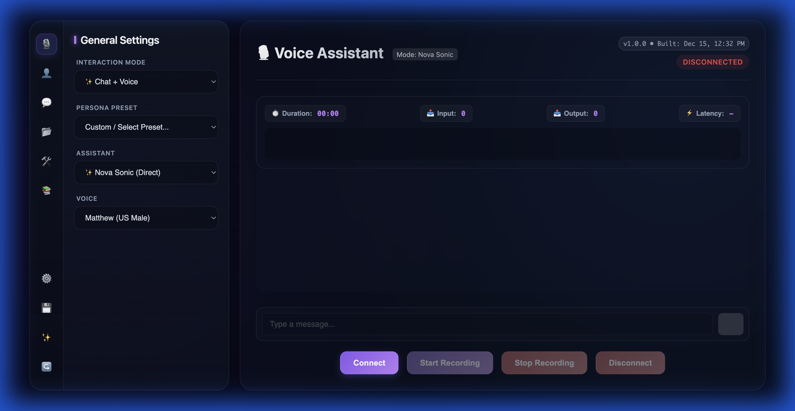

# Voice S2S User Guide

Welcome to the **Voice S2S** (Speech-to-Speech) Assistant! This guide provides a comprehensive overview of the application's features, including how to configure it, manage tools, and design custom agent behaviors.

## 1. Getting Started

### Accessing the Application
Once the server is running, open your web browser (Chrome recommended) and navigate to:
**http://localhost:8080**

### Connecting
1.  **Launch**: You will see the main interface.
2.  **Connect**: Click the **Connect** button.
3.  **Permissions**: Allow Microphone access when prompted.
4.  **Ready**: Listen for the "Swoosh" sound. The status bar will turn green (Connected).

---

## 2. Core Interaction Modes

Use the sidebar navigation to access different settings and modes.

### Brain Modes (Sidebar: 🎙️ Voice / General)
Select the "Assistant" dropdown:
*   **Nova Sonic Direct**: Default, high-speed mode. Best for general conversation and simple tool queries.
*   **Bedrock Agent**: Uses complex, pre-defined agents (like the "Banking Bot").

### Interaction Modes (Sidebar: 🎙️ Voice / General)
*   **✨ Chat + Voice**: Interact via voice or text. See transcripts.
*   **🎤 Voice Only**: Microphone active, text input hidden. Hands-free.
*   **💬 Chat Only**: Text input only. Microphone disabled.

### Ending a Session & Feedback
When you have finished your conversation, click **Disconnect**.
*   **Feedback Modal**: A dialog will appear asking for your rating (Thumbs Up 👍 or Down 👎).
*   **Comments**: You can optionally add text comments to explain your rating.
*   **History**: Your rating will be saved and displayed as an icon in the **Chat History** sidebar for future reference.

---

## 3. Customization

### Personas & Voices (Sidebar: 👤 Prompts & Personas)
*   **Persona Preset**: Select a personality (e.g., "Coding Assistant", "Pirate"). This changes the System Prompt.
*   **Voice**: Select a speech synthesis voice (e.g., Matthew, Tiffany).

### Knowledge Bases (Sidebar: 📚 Knowledge Bases)
Add external knowledge for the AI to reference.
1.  **View**: See the list of active Knowledge Bases.
2.  **Add**:
    *   **Name**: A label for your reference.
    *   **ID**: The AWS Knowledge Base ID (e.g., `KCDO7ZUFA1`).
    *   **Model**: Select the model to use for retrieval.
    *   Click **Add Knowledge Base**.

---

## 4. Tool Configuration

Manage the tools available to the AI.

### Enabling/Disabling Tools (Sidebar: 🛠️ Tools)
*   Toggle checkboxes in the list to enable or disable specific tools (e.g., `get_weather`, `get_time`).
*   **Select/Deselect All**: Quick actions for bulk management.

### Creating & Editing Tools
To create or edit tools, click the **🛠️ Manage / Create Tools** button. This opens the **Tool Manager**.

**Tool Manager Features:**
*   **New Tool**: Click to create a fresh tool definition.
*   **Form-Based Editor**:
    *   **Tool Name**: Unique identifier (e.g., `lookup_order`).
    *   **Description**: What the tool does.
    *   **Category**: Group tools (System, Banking, Custom). Use "Smart Input" for new categories.
    *   **Schema**: Define input parameters visually or via raw JSON.
*   **Save**: Persists the tool definition to the backend.

---

## 5. AWS Configuration (Sidebar: ⚙️ System Settings)

Configure your AWS credentials for the session.
1.  Click **🔐 Configure AWS**.
2.  **Modal**: Enter your **Access Key ID**, **Secret Access Key**, **Region**, and optional **Agent Core Runtime ARN**.
3.  **Security**: These credentials are stored in your browser's session storage and are not saved to the server effectively. They persist only for the current session.

---

## 6. Workflow Creator

Design custom agent behaviors using a visual flowchart interface.

**Access**: Click **✍️ Workflow Creator** in the **Sidebar: 📂 Workflows** section.

### Using the Editor
The editor uses a **form-based** approach to build the graph:

1.  **Nodes Tab**:
    *   Click **+ Add Node**.
    *   **Select Node**: Click the new node in the list to edit it.
    *   **Type**: Choose `Start`, `End`, `Process` (Message), `Decision`, or `Tool Call`.
    *   **Label**: The text or message for the node.
    *   **Tool Config**: If type is `Tool Call`, enter the tool name (e.g., `get_balance`).

2.  **Connections Tab**:
    *   Click **+ Add Connection**.
    *   **Edit Link**: Select the connection.
    *   **From / To**: Choose the source and destination nodes from the dropdowns.
    *   **Label**: Optional text (e.g., "Yes", "No") for decision branches.

3.  **Visualization**: The graph updates automatically as you make changes. Use the **Zoom** controls to navigate larger graphs.

4.  **Saving & Injection**:
    *   Click **💾 Save Workflow**.
    *   The workflow is saved and **automatically injected** into the active Persona's logic. The AI will immediately begin following the new flow.

5.  **Guide**: Click the **📖 Guide** button in the editor for in-app help.

---

## 7. Troubleshooting

*   **"Microphone Permission Denied"**: Check browser address bar settings. Ensure you are on `localhost` or `https`.
*   **"Connection Failed"**: Verify the backend is running on port 8080.
*   **Changes Not Applying**: Try refreshing the page or clicking "Revert" in the Workflow Editor to reload the current state.
