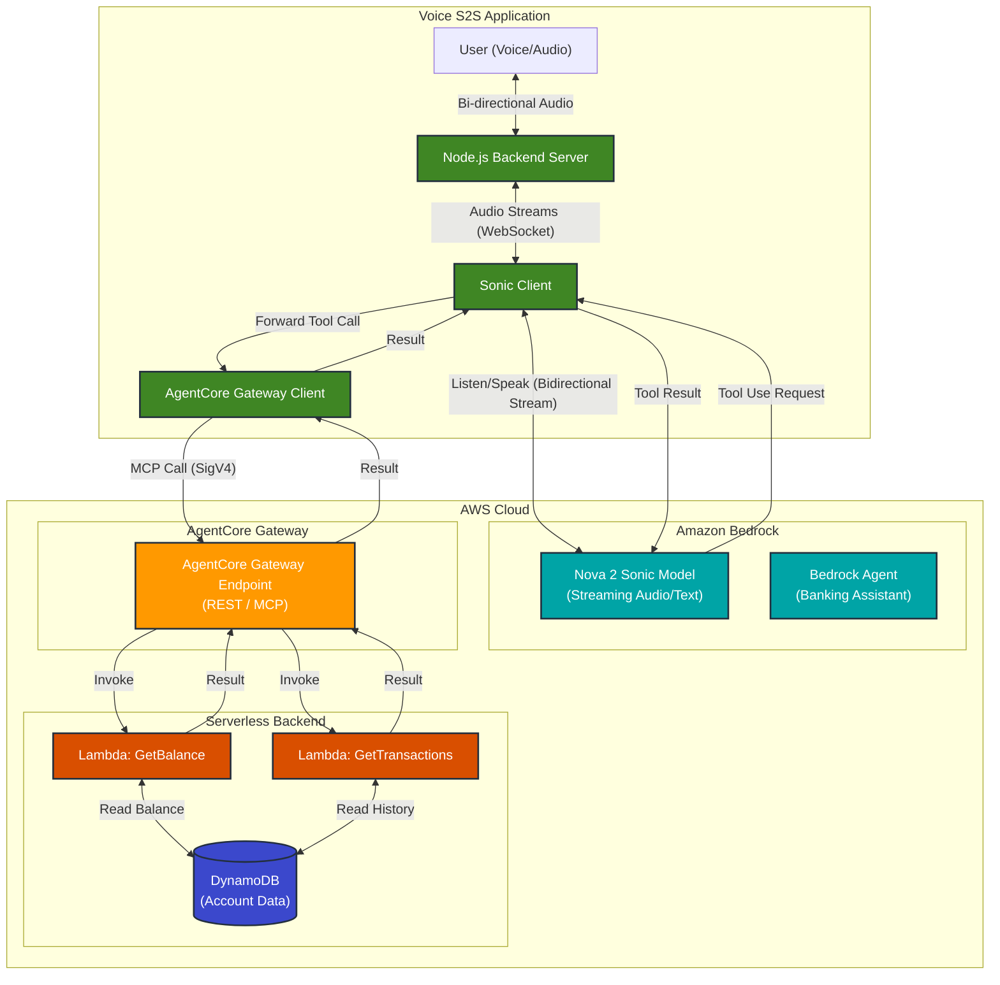

# System Architecture

This document outlines the architecture of the Voice S2S application, highlighting the integration between the client application, Amazon Bedrock's Nova 2 Sonic, and the serverless backend via the AgentCore Gateway.

## Architecture Diagram

## Component Overview

### 1. Client Application (Voice S2S)
The core of the user experience is the **Voice S2S Application**, a Node.js-based server that handles the bi-directional audio stream with the user.
-   **Sonic Client**: Manages the persistent WebSocket connection to Amazon Nova 2 Sonic. It handles the low-latency audio input and output, allowing for natural, interruptible conversations.
-   **AgentCore Gateway Client**: A specialized client that acts as a bridge for tool execution. When Nova 2 Sonic decides it needs to perform an action (like checking a balance), it sends a tool use request back to the Sonic Client. The Sonic Client then forwards this request to the AgentCore Gateway Client.

### 2. Amazon Bedrock (AI Layer)
-   **Nova 2 Sonic**: The primary speech-to-speech model. It provides very fast speech recognition and generation, capable of understanding speech, executing tool logic, and generating speech responses in real-time.
-   **Bedrock Agent**: Represents the "brain" of the banking assistant, defining the available actions and persona, though Nova 2 Sonic handles the direct interaction in this architecture.

### 3. AgentCore Gateway
This is a critical infrastructure component that bridges the gap between the generative AI models and external tools.
-   It exposes a standard endpoint (REST/MCP) that the client application can securely call using AWS SigV4 signing.
-   It routes these requests to the appropriate backend Lambda functions. This abstraction allows the AI model to call tools without needing direct network access to the backend infrastructure.

### 4. Serverless Backend
The actual business logic and data reside here.
-   **AWS Lambda**: Functions like `GetBalance` and `GetTransactions` contain the logic to retrieve user data. They are triggered by the AgentCore Gateway.
-   **DynamoDB**: The NoSQL database storing account information and transaction histories. The Lambda functions read from this database to fulfill user requests.
