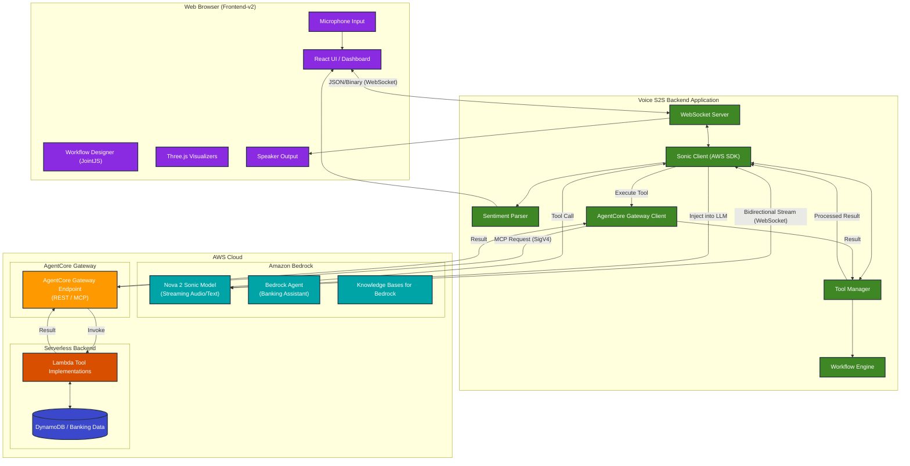

# System Architecture

This document outlines the architecture of the Voice S2S application, highlighting the integration between the client application, Amazon Bedrock's Nova 2 Sonic, and the serverless backend via the AgentCore Gateway.

## Architecture Diagram

## Component Overview

### 1. Web Browser (Frontend-v2)
The frontend is a modern React application built with Next.js, providing a rich, interactive interface.
-   **React UI**: A responsive dashboard for chat and voice interaction.
-   **Workflow Designer**: A node-based visual editor using JointJS for building complex interaction flows.
-   **Three.js Visualizers**: High-performance audio visualizations including particle systems and fluid dynamics.
-   **Voice Processing**: Handles microphone input and speaker output with efficient binary streaming.

### 2. Node.js Backend Server
The backend orchestrates the communication between the browser and various AWS services.
-   **WebSocket Server**: Manages real-time binary and JSON communication with the frontend.
-   **Sonic Client**: Manages the persistent WebSocket connection to Amazon Nova 2 Sonic using the AWS SDK.
-   **Tool Manager & Workflow Engine**: Maps LLM tool calls to backend logic and manages the state of active workflows.
-   **Sentiment Parser**: Analyzes LLM output in real-time to extract sentiment tags and provide visual feedback.
-   **AgentCore Gateway Client**: Securely routes tool requests to the AgentCore infrastructure.

### 3. Amazon Bedrock (AI Layer)
-   **Nova 2 Sonic**: The primary speech-to-speech model, providing low-latency recognition and generation.
-   **Bedrock Agent**: Definable agentic behaviors and reasoning capabilities.
-   **Knowledge Bases**: RAG-powered retrieval for grounding AI responses in technical or private data.

### 4. AgentCore Gateway & Serverless Backend
-   **AgentCore Gateway**: A secure bridge (SigV4) that exposes standard endpoints for tool execution.
-   **AWS Lambda**: Serverless functions containing the business logic for banking operations (Balance, Transactions, Identity Verification).
-   **DynamoDB**: Scalable NoSQL database storing user account data and transaction logs.

