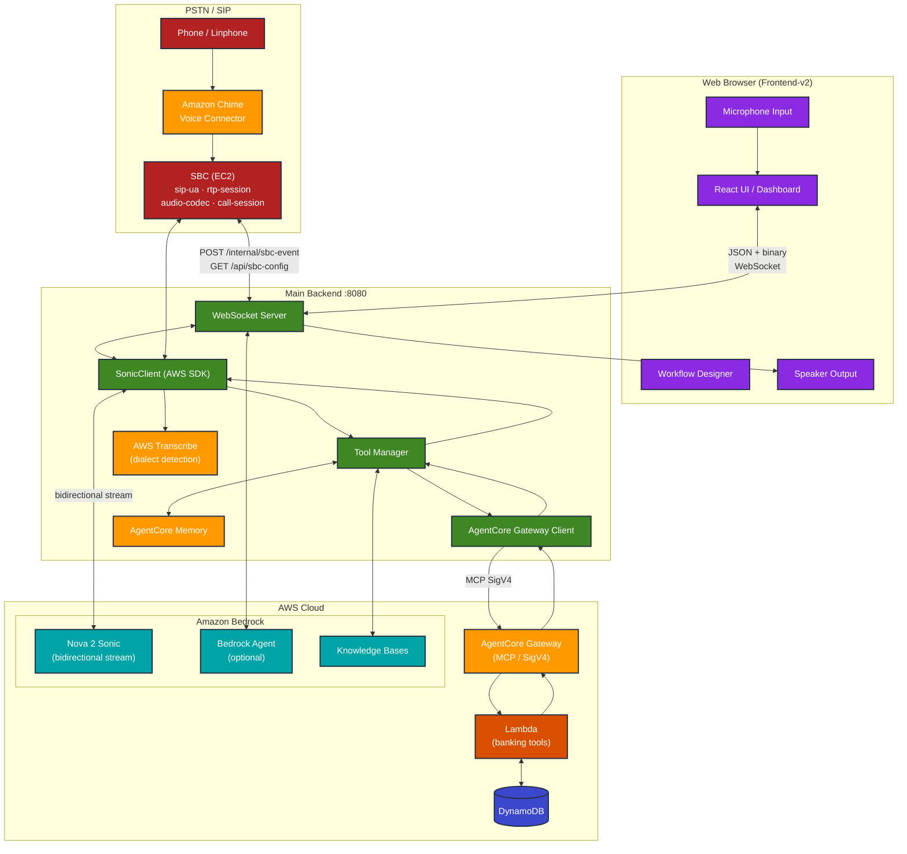

# System Architecture

A real-time **voice AI demo platform** built on Amazon Nova 2 Sonic. A caller speaks — the AI understands, calls banking tools, and responds in natural speech. Supports both browser (WebSocket) and phone (SIP/PSTN) as input channels.

---

## High-Level Diagram


```mermaid
graph TD
    classDef aws fill:#FF9900,stroke:#232F3E,color:white,stroke-width:2px;
    classDef client fill:#3F8624,stroke:#232F3E,color:white,stroke-width:2px;
    classDef bedrock fill:#00A4A6,stroke:#232F3E,color:white,stroke-width:2px;
    classDef compute fill:#D94F00,stroke:#232F3E,color:white,stroke-width:2px;
    classDef database fill:#3B48CC,stroke:#232F3E,color:white,stroke-width:2px;
    classDef ui fill:#8A2BE2,stroke:#232F3E,color:white,stroke-width:2px;
    classDef sbc fill:#B22222,stroke:#232F3E,color:white,stroke-width:2px;

    subgraph Browser ["Web Browser (Frontend-v2)"]
        UI["React UI / Dashboard"]:::ui
        WorkflowDesigner["Workflow Designer"]:::ui
        Mic["Microphone Input"]:::ui
        Speakers["Speaker Output"]:::ui
    end

    subgraph PhoneChannel ["PSTN / SIP"]
        Phone["Phone / Linphone"]:::sbc
        ChimeVC["Amazon Chime\nVoice Connector"]:::aws
        SBC["SBC (EC2)\nsip-ua · rtp-session\naudio-codec · call-session"]:::sbc
    end

    subgraph Backend ["Main Backend  :8080"]
        WSServer["WebSocket Server"]:::client
        SonicClient["SonicClient (AWS SDK)"]:::client
        ToolManager["Tool Manager"]:::client
        Transcribe["AWS Transcribe\n(dialect detection)"]:::aws
        GatewayClient["AgentCore Gateway Client"]:::client
        MemorySvc["AgentCore Memory"]:::aws
    end

    subgraph AWS_Cloud ["AWS Cloud"]
        subgraph Bedrock ["Amazon Bedrock"]
            NovaSonic["Nova 2 Sonic\n(bidirectional stream)"]:::bedrock
            BedrockAgent["Bedrock Agent\n(optional)"]:::bedrock
            BedrockKB["Knowledge Bases"]:::bedrock
        end
        CoreGateway["AgentCore Gateway\n(MCP / SigV4)"]:::aws
        LambdaTools["Lambda\n(banking tools)"]:::compute
        DynamoDB[("DynamoDB")]:::database
    end

    Mic --> UI
    UI <-->|"JSON + binary\nWebSocket"| WSServer
    WSServer --> Speakers

    Phone --> ChimeVC --> SBC
    SBC <-->|"POST /internal/sbc-event\nGET /api/sbc-config"| WSServer

    WSServer <--> SonicClient
    SBC <--> SonicClient
    SonicClient <-->|"bidirectional stream"| NovaSonic
    SonicClient --> Transcribe
    SonicClient --> ToolManager
    ToolManager --> GatewayClient
    GatewayClient -->|"MCP SigV4"| CoreGateway
    CoreGateway --> LambdaTools
    LambdaTools <--> DynamoDB
    LambdaTools --> CoreGateway --> GatewayClient --> ToolManager --> SonicClient
    ToolManager <--> BedrockKB
    ToolManager <--> MemorySvc
    WSServer <--> BedrockAgent
```

---

## Architecture Detail

### Input Channels

```
┌──────────────────────────────────────────────────────────────────────────────────┐
│                              INPUT CHANNELS                                      │
│                                                                                  │
│   ┌─────────────────────┐              ┌──────────────────────────────────────┐ │
│   │   Browser (Chrome)  │              │   PSTN / SIP Phone                   │ │
│   │                     │              │                                      │ │
│   │  Microphone (PCM16) │              │   Linphone / Amazon Connect          │ │
│   │  Text (Chat mode)   │              │   ↓ SIP INVITE (UDP :5060)           │ │
│   └──────────┬──────────┘              │   ↓ RTP audio (G.711 μ-law)         │ │
│              │ WebSocket               │   ↓ Amazon Chime Voice Connector     │ │
│              │ ws://:8080/sonic        └───────────────┬──────────────────────┘ │
└──────────────┼────────────────────────────────────────┼─────────────────────────┘
               │                                         │
               ▼                                         ▼
┌──────────────────────────────┐      ┌──────────────────────────────────────────┐
│      MAIN BACKEND            │      │          SBC  (EC2, --network host)      │
│   Node.js  :8080             │      │   node dist/sbc/sbc-server.js            │
│                              │      │                                          │
│  server.ts                   │◄─────│  sip-ua.ts     SIP UAS (INVITE/ACK/BYE) │
│  ├─ WebSocket handler        │ POST │  rtp-session   jitter buffer, port pool  │
│  ├─ Tool routing             │/internal│ audio-codec  G.711↔PCM16 + resample  │
│  ├─ Session orchestration    │/sbc-event│call-session  per-call orchestrator  │
│  └─ Static file serving      │      │  sbc-event-bridge → POST to backend     │
│     (Next.js export)         │      └──────────┬───────────────────────────────┘
└──────────────┬───────────────┘                 │
               │                                 │  (same SonicClient, same tools)
               ▼                                 ▼
┌──────────────────────────────────────────────────────────────────────────────┐
│                        AMAZON NOVA 2 SONIC                                   │
│              InvokeModelWithBidirectionalStream  (us-east-1)                 │
│                                                                              │
│   PCM16@16kHz in ──►  Speech-to-Speech AI  ──► PCM24kHz audio out           │
│   Text in       ──►  (understands, reasons) ──► Text transcript out          │
│                       ↕ tool_use events                                      │
└─────────────────────────────────────┬────────────────────────────────────────┘
                                      │  tool_use / tool_result
                                      ▼
┌──────────────────────────────────────────────────────────────────────────────┐
│                          TOOL LAYER                                           │
│                                                                               │
│   tool-manager.ts  (loads tools/*.json at startup)                           │
│                                                                               │
│   LOCAL tools                    GATEWAY tools (AgentCore MCP)               │
│   ──────────────────             ──────────────────────────────               │
│   get_server_time                perform_idv_check                           │
│   search_knowledge_base          get_account_balance    ┐                    │
│   uk_branch_lookup               get_account_transactions│ Lambda-backed     │
│   manage_recent_interactions     create_dispute_case    │ AWS SigV4 signed   │
│   calculate_max_loan             get_mortgage_rates     ┘                    │
│   lookup_merchant_alias          check_credit_score                          │
│   value_property                                                             │
└──────────────────────────────────────────────────────────────────────────────┘
                                      │
                    ┌─────────────────┼─────────────────┐
                    ▼                 ▼                  ▼
         ┌─────────────────┐  ┌────────────┐  ┌────────────────────┐
         │  AgentCore      │  │  Bedrock   │  │   MemoryService    │
         │  Gateway        │  │  Agent     │  │   (AgentCore)      │
         │  (MCP / SigV4)  │  │  (optional │  │                    │
         │                 │  │  complex   │  │  Cross-session     │
         │  → Lambda fns   │  │  workflows)│  │  customer memory   │
         └─────────────────┘  └────────────┘  └────────────────────┘
```

---

### Audio Pipeline

```
BROWSER (voice mode)
  Mic → PCM16 16kHz mono → 4096-sample WebSocket binary frames
                ↓
  server.ts receives binary → sonicClient.sendAudioChunk()
                ↓
  TranscribeClient (AWS Transcribe Streaming)
    → partial/final transcripts → dialect detection
    → if language switches → voice ID swap via transition-handler.ts
                ↓
  SonicClient (bidirectional stream to Nova 2 Sonic)
    → model speech output → PCM24kHz → browser playback

PHONE (SBC)
  PSTN → Chime Voice Connector → RTP G.711 μ-law 8kHz
                ↓
  rtp-session.ts (jitter buffer, dgram UDP)
                ↓
  audio-codec.ts: G.711 decode → resample 8kHz→16kHz → PCM16
                ↓
  SonicClient (same as browser path above)
                ↓
  Nova 2 Sonic audio output → resample 24kHz→8kHz → G.711 encode → RTP back
```

---

### Prompt Composition

```
core-system_default.txt          ─┐
core-guardrails.txt               │
core-tool_access_assistant.txt    ├─► Assembled system prompt sent at session start
persona-{name}.txt                │
workflow-{name}.json  (as text)  ─┘
hidden-dialect_detection.txt      (silently appended)

Langfuse (optional): fetches prompts labelled "production"; falls back to local files
```

Available personas: `BankingDisputes`, `BankingMaster`, `SimpleBanking`, `mortgage`, `french_tutor`, `sci_fi_bot`, `pirate` (and more)

Available workflows: `disputes`, `banking`, `idv`, `triage`, `transaction-investigation`, `context`, `banking-master`, `mortgage`, `sci_fi_bot`

---

## Frontend Views

```
Next.js (static export, served by backend at :8080)

Sidebar icons → views:
  💬 Chat      — live transcript, tool events, audio waveform
  📋 History   — saved sessions with full transcripts
  🔀 Workflow  — visual state machine (WorkflowDesigner)
  ⚙️  Settings  — General / Credentials / Phone (SBC) tabs
  📞 Phone     — live SBC call monitoring panel (active + history)

AppContext.tsx — central state: messages, sbcCalls, activeView
useWebSocket  — WS lifecycle, dispatches all inbound events
useAudioProcessor — mic capture, playback, VAD muting
```

---

## AWS Services

| Service | Purpose |
|---|---|
| **Amazon Nova 2 Sonic** | Core speech-to-speech AI (bidirectional stream) |
| **AWS Transcribe Streaming** | Parallel transcript + language ID for dialect detection |
| **AgentCore Gateway** | MCP-style tool dispatch to Lambda functions (SigV4 signed) |
| **AgentCore Memory** | Cross-session customer history |
| **Bedrock Agent** (optional) | Complex multi-step workflow orchestration |
| **Amazon Chime Voice Connector** | SIP trunk / PSTN ingress for phone calls |
| **EC2** | Hosts SBC container (host networking required for RTP) |
| **Lambda** | Backs banking tools (balance, transactions, IDV, disputes) |
| **DynamoDB** | Banking data store for Lambda tools |
| **Bedrock Knowledge Bases** | RAG retrieval for grounding responses |
| **Langfuse** | Prompt versioning, trace observability, user feedback scoring |

---

## Key Design Decisions

| Decision | Rationale |
|---|---|
| No external SIP library | SIP UAS implemented raw over `dgram` UDP in `sip-ua.ts` — zero dependency, full control |
| Tool results injected as TEXT | Native Nova Sonic `toolResult` event is undocumented/unstable; results formatted as `[SYSTEM] Tool output:` user messages |
| Audio block turn separator | After each `interactionTurnEnd`, the silence keepalive block is closed and reopened after 2 s to prevent Nova Sonic errors in chat mode from accumulating silence frames |
| Dual brain modes | Nova Sonic Direct (~200-500 ms) for standard turns; Bedrock Agent (~1-3 s) for complex multi-step orchestration |
| Static frontend | Next.js `output: 'export'` served directly from Node.js — single process, no separate web server |
| Presigned S3 deploy | EC2 IAM role lacks `s3:GetObject` directly; deployment uses presigned URLs via local AWS credentials |

---

## Deployed Infrastructure (EC2 i-0ecafa787315efb44, us-west-2)

```
nova-backend   — main Node.js backend (dist hotpatched, no image rebuild needed)
nova-sbc       — SBC container (--network host, ECR image nova-sbc:v15)

Deploy bucket: voice-s2s-deploy-us-west-2-388660028061
SBC ECR repo:  nova-sbc-artifacts-388660028061
```
